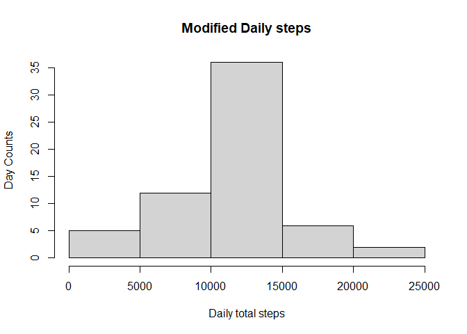

## Loading and preprocessing the data

Conversion NA values into 0


```r
library(data.table)
zipfile <-unzip("activity.zip")
activity <-data.table(read.csv(zipfile,header=TRUE,na.strings = "NA"))

 
activity$date <- as.Date(activity$date)
act_dt<-activity[complete.cases(activity)]
```

## What is mean total number of steps taken per day?


```r
group_dt<-act_dt[,sum(steps), by=date]
names(group_dt)<-c("date","tot_steps")
hist(group_dt$tot_steps,xlab="Steps taken per day",ylab="Day counts",main="Total number of steps taken per day")
```

<!-- -->

Mean of total steps per day

```r
group_dt[,mean(tot_steps)]
```

```
## [1] 10766.19
```

Median of total steps per day

```r
group_dt[,median(tot_steps)]
```

```
## [1] 10765
```
## What is the average daily activity pattern?


```r
group_interval_dt<-act_dt[,mean(steps),by=interval]
names(group_interval_dt)<-c("interval","meanstep")

plot(group_interval_dt$interval, group_interval_dt$meanstep, type="l", xlab="Daily interval", ylab="Avergage steps", main="Average Daily Activity Pattern")
```

<!-- -->

max average step and its interval finding


```r
group_interval_dt[ meanstep==max(meanstep),]
```

```
##    interval meanstep
## 1:      835 206.1698
```
## Imputing missing values

Counting NA values

```r
nrow(activity[!complete.cases(activity)])
```

```
## [1] 2304
```

imputing missing values by assigning interval mean value

```r
activity$steps<-as.numeric(activity$steps)
for( i in 1:nrow(activity))
{
        if(is.na(activity[i]$steps)){
                activity[i]$steps<-group_interval_dt[interval==activity[i]$interval,meanstep]
        }
}
```

creating new data set with imputed NA

```r
new_actDt <- activity

group_new_actDt<-new_actDt[, sum(steps), by=date]
names(group_new_actDt)<-c("date","totsteps")

hist(group_new_actDt$totsteps,xlab="Daily total steps",ylab="Day Counts",main="Modified Daily steps")
```

<!-- -->

Comparing with previous histogram, modified histogram shows more centralization around mean.

new mean

```r
group_new_actDt[,mean(totsteps)]
```

```
## [1] 10766.19
```
new median

```r
group_new_actDt[,median(totsteps)]
```

```
## [1] 10766.19
```
new mean and median are identical.

## Are there differences in activity patterns between weekdays and weekends?

creating factor variable

```r
Sys.setlocale("LC_TIME","English")
```

```
## [1] "English_United States.1252"
```

```r
for( i in 1:nrow(new_actDt)){
        if( weekdays(new_actDt[i,date]) %in% c("Monday","Tuesday","Wednesday","Thursday","Friday")){
                new_actDt[i, "WeekdayType"] <-"Weekday"
        }else{
                new_actDt[i, "WeekdayType"] <-"Weekend"
        }
}
  
new_actDt$WeekdayType<-as.factor(new_actDt$WeekdayType) 
```

plot weekday and weekedn ingterval

```r
library(ggplot2)

plotData<-new_actDt[ , mean(steps), by=.(WeekdayType, interval)]
names(plotData)<-c("WeekdayType","interval","meansteps")

ggplot(plotData,aes(x=interval,y=meansteps,col=WeekdayType) )+geom_line()+ggtitle("Activity pattern between Weekday and Weekend")+xlab("Interval")+ylab("Average steps") 
```

<!-- -->

Based on plotted chart, We can guess that Weekend activity is overally steady all day long. 
